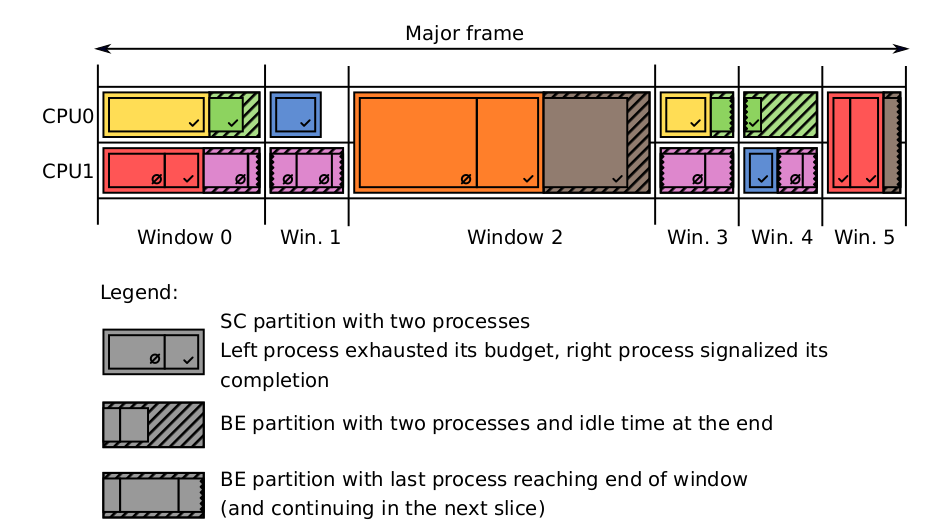
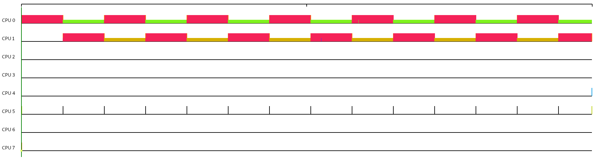
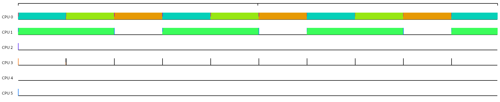

## Compilation

Initialize git submodules:

    git submodule update --init
    git submodule foreach --recursive 'if [ $(git config remote.origin.url) = . ]; then git config remote.origin.url "$toplevel"; fi'

We use the Meson build system. On Debian-based distro, it can be
installed by:

    apt install meson

It is recommended, though not necessary, to uses Meson >= 0.52. If
your distribution has an older version, you can install a new one by:

    pip3 install --user meson

Then build everything by running:

    make

### Cross compilation

DEmOS scheduler can be easily cross compiled thanks to [Meson cross
compilation support][cross]. We support cross compilation for 64bit
ARM out of the box:

    sudo apt install g++-aarch64-linux-gnu
	make aarch64

The resulting binary `build-aarch64/src/demos-sched` can be copied to
the target ARM system.

[cross]: https://mesonbuild.com/Cross-compilation.html

## Usage

    demos-sched -c <CONFIG_FILE> [-h] [-g <CGROUP_NAME>]
        -c <CONFIG_FILE>   path to configuration file
        -g <CGROUP_NAME>   name of root cgroups, default "demos"
        -h                 print this message

Configuration files are written according to [DEmOS specification](./demos-sched.pdf)

- Major frame consist of one or more windows cyclically scheduled at time slots defined by `length`.
- Window consist of one or more slices scheduled at different CPUs in one time. Format of CPU is its number `cpu: 1`, or range `cpu: 0-2`, or combination of both `cpu: 0,2,5-7`
- Slice consist of safety critical `sc_partition` and best effort `be_partition` partitions
- Partition consist of arbitrary number of processes which are cyclically scheduled in time according to their budgets within slice.




### Example configurations

``` yaml
# CPU_switching.yaml
# one process switched between two cpus
#
# all times in ms
# Major frame
windows:
  - length: 500
    slices:
      - cpu: 0
        sc_partition: SC1
  - length: 500
    slices:
      - cpu: 1
        sc_partition: SC1

partitions:
  - name: SC1
    processes:
      - cmd: yes > /dev/null
        budget: 500
```

To verify that `demos-sched` executes the partitions as intended, you
can record and visualise the execution trace with the following
commands:

    trace-cmd record -F -c -e sched_switch build/src/demos-sched -c …
    kernelshark trace.dat

The result will look like in the figure below:


``` yaml
# more_partitions.yaml
# two slices with safety critical and best effort tasks within one window

# all times in ms
# Major frame
#period: 100 # not used, do we need this?
windows:
  - length: 1500
    slices:
      - cpu: 0
        sc_partition: SC1
        be_partition: BE1
      - cpu: 1
        sc_partition: SC2

partitions:
  - name: SC1
    processes:
      - cmd: yes > /dev/null
        budget: 500
      - cmd: yes > /dev/null
        budget: 500
  - name: BE1
    processes:
      - cmd: yes > /dev/null
        budget: 500
  - name: SC2
    processes:
      - cmd: yes > /dev/null
        budget: 1000
```



- if everything sucks run this script
    ```
    src/release_agent.sh
    ```

