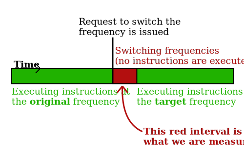
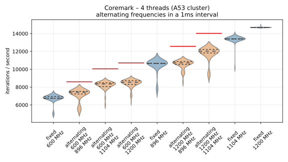
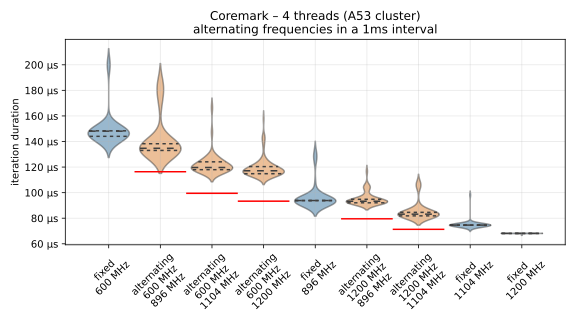
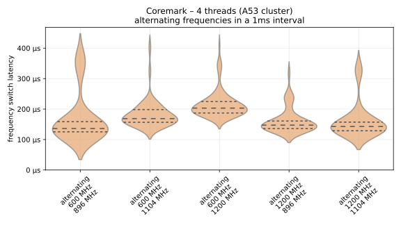

# CPUFreq frequency switching latency

for the **NXP i.MX8QM** board

When the Linux kernel requests a CPU frequency change from the hardware, the change is not instantaneous. The estimated latency according to the official kernel device tree is 150 µs. This experiment measures the real latency of a CPU frequency switch.

## Methodology

Previous measurements suggested that the frequency switch is blocking, and the CPU core does not execute instructions until the new frequency is set.



**Idea:** Run a CPU-intensive benchmark under DEmOS, periodically change the CPU frequency, measure the overhead and use it to estimate the switching latency.

The multi-threaded version of the [CoreMark](https://www.eembc.org/coremark/) benchmark was used for this measurement, which is part of the benchmark suite included with [Thermobench](https://github.com/CTU-IIG/thermobench). Output of the benchmark ("CoreMark score") is the number of iterations per second on a set of computations.

The benchmark ran on the 4 cores in the A53 cluster of the CPU. A DEmOS configuration was used, with 1 ms time windows, and a frequency switch at the beginning of each time window.

For each pair of measured frequencies, an idealized CoreMark score was computed as an average of the scores reached when running on each of the two frequencies individually. This idealized score was used to calculate the overhead and from it, estimate the switching latency:

```python
WINDOW_LENGTH = 1/1000  # 1 millisecond

# if there was no switching overhead, the measured score should be the average of scores for the 2 CPU frequencies we are switching between
expected_coremark_score = (AVG_SCORE[frequency1] + AVG_SCORE[frequency2]) / 2

iteration_period = 1 / reached_coremark_score
expected_period = 1 / expected_coremark_score

total_overhead = iteration_period - expected_period
switches_per_iteration = iteration_period / WINDOW_LENGTH
latency = total_overhead / switches_per_iteration
```

## Implementation

The `record.fish` script in the current directory runs the benchmarks 50 times for each tested pair of frequencies, and separately for each available frequency to provide a baseline.

The resulting dataset is then parsed using the PowerShell `csv` function inside `fns.ps1`, which creates a `dataset.csv` file. This file is then loaded in `plot.py`, which computes the latency estimate and plots it using *Matplotlib*. 3 charts are rendered: iterations per second, period (duration of each iteration) and switching latency.

## Results

### Iterations per second

The red lines above the violin plots for alternating CPU frequencies represent the idealized estimate averaged from the baseline measurements with fixed CPU frequency.



### Iteration periods (average duration)

By inverting the *iterations per second* shown in the previous chart, we get the average duration of each iteration (here, the baseline measurements are omitted):



### Latency estimate

Using the formula described above, the following latency estimates are calculated:



## Discussion

The CPU frequency switching latency varies depending on how many frequencies are skipped. For a switch between neighboring frequencies (e.g. 600 MHz and 896 MHz), the latency estimate approximately **matches the 150 µs figure** provided in the official device tree. A switch between the lowest and the highest frequency (600 MHz to 1200 MHz) takes around **200 µs** to complete.
